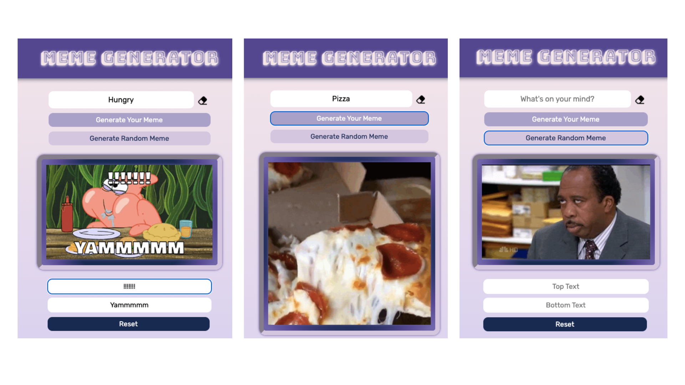

# Meme Generator

Transform your words into hilarious memes with this user-friendly Chrome extension.

## Preview

## Get Started

<ul>

<li>Click the "Fork" button at the top right corner of the repository page to create a copy of the repository in your own GitHub account.</li>
<li>Once the fork is complete, clone the repository to your local machine using a Git client like GitKraken, GitHub Desktop, or the command line.</li>
<li>Make any modifications to the extension code as necessary to customize it for your needs. Be sure to follow any licensing requirements and give credit to the original author as necessary.</li>
<li>Update the extension manifest file (usually named manifest.json) to reflect your own extension details, such as the name, description, and version number.</li>
<li>Test the modified extension by loading it into Chrome as an unpacked extension. To do this, open Chrome, go to the Extensions page (chrome://extensions), enable Developer mode, and click "Load unpacked" to select the folder where you saved the modified extension files.</li>
<li>Once you're satisfied with your changes and the extension works as expected, create a ZIP file of the modified extension folder.</li>
<li>Log in to the Chrome Developer Dashboard using your Google account, and click "Add new item" to create a new extension listing.</li>
<li>Fill out the required information, upload the ZIP file of your modified extension, and submit the extension for review.</li>
<li>Once the review process is complete and your extension is approved, it will be available for download in the Chrome Web Store.</li>

</ul>

## License
Distributed under the MIT License. See LICENSE.txt for more information.

## Show Your Support
If you find this project helpful, please give it a ⭐️.
